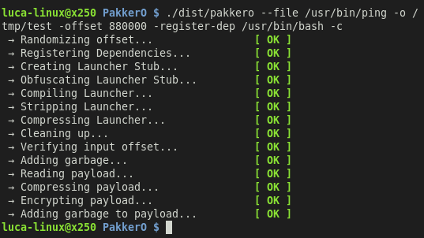
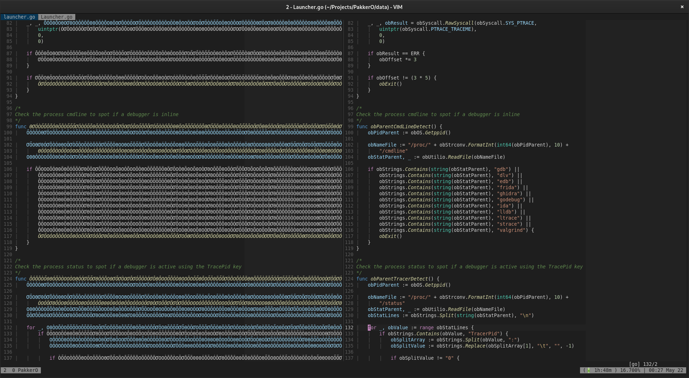
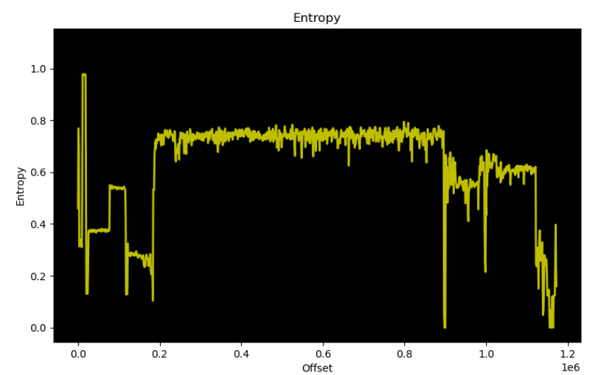
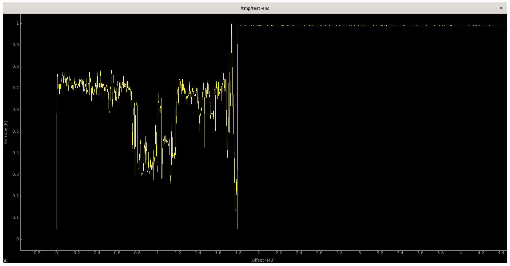
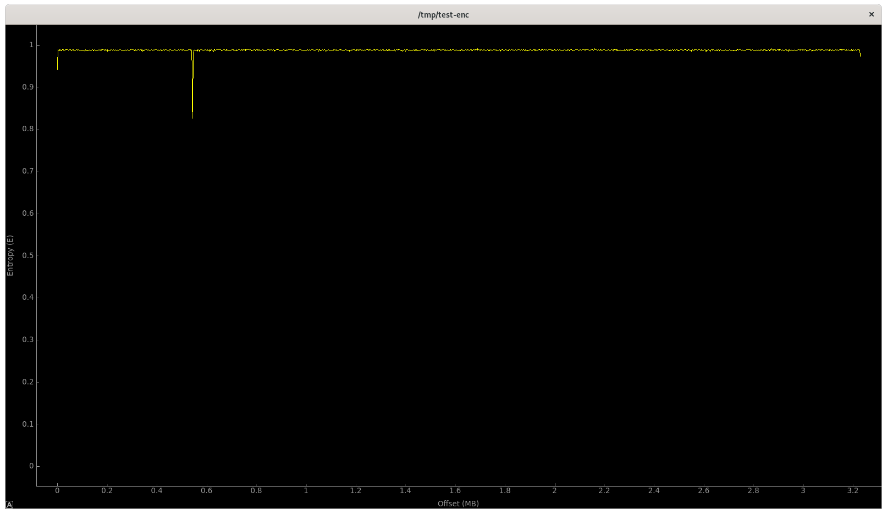
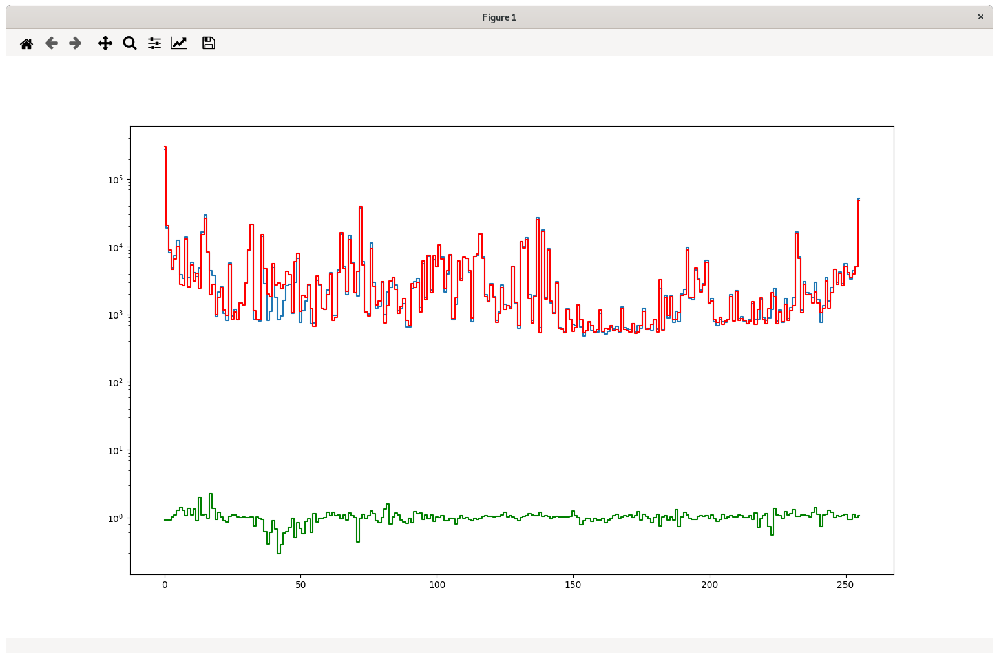

# PakkerO


Credit: [alegrey91](https://github.com/alegrey91) for the logo! Thanks!

[](http://perso.crans.org/besson/LICENSE.html)

## Introduction

**PakkerO** is a binary paker written in Go made for fun and educational purpose.

PakkerO is divided in two main pieces, the packer part (PakkerO itself) and the
launcher part.

It can be used to protect and launch various type of payloads, from scripts (bash, php, python...) to
elf files.

It is not recommended for very small files as the launcher itself can vary from ~700kb to ~1.7mb depending
on compression. On files above 2.6mb there is gain, else the resulting binary is larger than the original:

```
base-bin    1.2M    ->  1.6M
smaller-bin 2.4M    ->  2.3M
small-bin   3.7M    ->  3.0M
medium-bin  25M     ->  16M
big-bin     148M    ->  88M
```

With compression disabled, all resulting file size are ~1mb higher, making it suitable for 5+mb files.  

## Install

If you have a [Go](https://golang.org/) environment ready to go, it's as easy as:

```bash
go get github.com/89luca89/pakkero
```

Once you retrieved you are ready to build:

```bash
go build github.com/89luca89/pakkero
```

The following are hard dependencies:

```
 - go -> to build the launcher
 - ls
 - sed
 - strip -> to strip the launcher
```

The following are weak dependencies

```
 - upx -> needed for launcher compression (optional)
```

**Dependencies are checked at runtime and an error message will specify what is missing**

# Disclaimer

**This is a for-fun project**, complete protection for a binary is **impossible**, in a way or another there is always someone that will reverse it, even if only baser on 0 an 1, so this is more abaout exploring some arguments that to create an anti-reverse launcher.

## Part 1: the packer

PakkerO can be launched like:

```bash
pakkero --file ./target-file -o ./output-file -offset 880000 -register-dep dependency-file -c
```



### Usage

Typing `pakker -h` the following output will be shown:

```bash
Usage: pakkero -file /path/to/file -offset OFFSET (-o /path/to/output) (-c) (-register-dep /path/to/file)
  -file <file>          Target file to Pack
  -o   <file>           place the output into <file> (default is <inputfile>.enc), optional
  -c                    compress the output to occupy less space (uses UPX), optional
  -offset               Offset where to start the payload (Number of Bytes)
  -register-dep         /path/to/dependency to analyze and use as fingerprint (absolutea, optional)
  -v                    Check pakkero version
```

Below there is a full explanation of provided arguments:

* **file**: The file we want to pack
* **o**: The file output that we will create
* **c**: (optional) If specificed, UPX will be used to further compress the Launcher
* **offset**: The number of bytes from where to start the payload (increases if not using compression)
* **regiser-dep** (optional) Path to a file that can be used to register the fingerprint of a dependency to ensure that the Launcher runs only if a file with similar fingerprint is present
* **v**: Print version

### Packaging

The main intent is to **not alter the payload in any way**, this can be very important
for types of binary that rely on specific order of instructions or relatively fragile timings.

#### Payload

For this purpose the payload is simply encrypted using AES256-GCM, and then compressed
using Zlib

During encryption, some basic operations are also performed on the payload:

- putting garbage random values before and after the payload to mask it
- reverse it and change each byte endianess

Encryption password is the hash SHA512 of the compiled launcher itself together with the
garbage values added to fill the file till the offset, thus providing
some integrity protection and anti-tampering.

#### Offset

The offset will decide **where in the output file the payload starts**.

Put simply, after the launcher is compiled (more on the launcher later), the payload is
attached to it. The offset ensures that the payload can be put anywhere after it.
All the space after the launcher until the payload is filled with random garbage.

Being part of the password itself, greater offset will make stronger the encryption, but
enlarge the final output file.

Optimal value are *at least* 800000 when compression is enabled and 1900000 when disabled.

### Obfuscation

The final thing the packer does is compiling the launcher. To protect some of the foundamental
part of it (namely where the offset starts) the launcher is *obfuscated* and heavily stripped down.

The technique utilized for obfuscating the function and variables name is based on typosquatting:



This is done in a pretty naive way, simply put, in the launcher each function/variable which name has
to be obfuscated, needs to start with the suffix **ob**, it will be then put into a secret map, and
each occurrence will be replaced in the file with a random string of lenght 128, composed only of runes that
have siilar shape, namely:

```go
    mixedRunes := []rune("0OÓÕÔÒÖŌŎŐƠΘΟ")
```

For pure strings in the launcher, they are detected using regular expressions, finding
all the words that are comprised between the three type of ticks supported in go

```
`
'
"
```

All of the strings found this way, are then replaced with a function that performs simple bitshifts to return
the original char value,

so a string becomes for example

```go
func ƠÔƠΘƠΘÓÒ . . . . ÓƠŐƠŌŎÕÒΟŌÔ() string {
    EAX := uint8(Ö0ΟÖΟŐŌŐŐŎÖŌÕ . . . .ÓOΘ0ΟŌŐŎŌÖÓÕƠ0ΟŎƠ.Sizeof(true))
    return string(
        []byte{
            (((EAX<<EAX^EAX)<<EAX<<EAX|EAX)<<EAX | EAX) << EAX << EAX,
            (((EAX<<EAX^EAX)<<EAX|EAX)<<EAX<<EAX | EAX) << EAX << EAX,
            (((EAX<<EAX^EAX)<<EAX|EAX)<<EAX<<EAX<<EAX | EAX) << EAX,
            ((EAX<<EAX^EAX)<<EAX<<EAX<<EAX<<EAX<<EAX | EAX),
            (((EAX<<EAX^EAX)<<EAX<<EAX<<EAX<<EAX|EAX)<<EAX | EAX),
            (((EAX<<EAX^EAX)<<EAX<<EAX<<EAX|EAX)<<EAX<<EAX | EAX),
        },
    )
}
```

credits for the string obfuscation part goes to [GH0st3rs](https://github.com/GH0st3rs/obfus)  Thanks!
as my implementation is started from that and tweaked to work in my workflow.

File is the **stripped**, using obviously **strip** with the flags:

```bash
    -sxX
    --remove-section=.bss
    --remove-section=.comment
    --remove-section=.eh_frame
    --remove-section=.eh_frame_hdr
    --remove-section=.fini
    --remove-section=.fini_array
    --remove-section=.gnu.build.attributes
    --remove-section=.gnu.hash
    --remove-section=.gnu.version
    --remove-section=.gosymtab
    --remove-section=.got
    --remove-section=.note.ABI-tag
    --remove-section=.note.gnu.build-id
    --remove-section=.note.go.buildid
    --remove-section=.shstrtab
    --remove-section=.typelink
```

Additionally, if using *UPX*, their headers are **removed and replaced with randomness**, to ensure simple
things like `upx -d` will not work.

Additionally a series of extra words are removed from the binary, to make it harder to do static analysis:

```
    .gopclntab
    .go.buildinfo
    .noptrdata
    .noptrbss
    .data
    .rodata
    .text
    .itablink
    .shstrtab
    .data
    .dynamic
    .dynstr
    .dynsym
    .gnu.version_r
    .gopclntab
    .got.plt
    .init_array
    .interp
    .itablink
    .rela.dyn
    .rela.plt
    .tbss
    .plt
    .init
    name runtime command cmd
    ptr process unicode main
    path get reflect context
    debug fmt sync sort
    size heap fatal call
    fixed slice bit file
    read write buffer encrypt
    decrypt hash state
    external internal float
    env trace pid
```

Output of readelf to see the effect:


#### File Entropy

Using binwalk to analyze the file entropy can give some hint on how the process works:

This is the entropy of the binary we want to package (for this example /usr/bin/bash):



This is the entropy of a packaged binary **without compression**



This is the entropy of a packaged binary **with compression**



In both cases (but mainly the first) it is possible to see when the launcher stops and
the payload starts. This is really not a problem, because the offset of garbage is
both preponed **and** postponed to the payload, and the "secret number" of when it starts is kept inside the launcher in an obfuscated form (like shown before)

This is obviously vulnerable, reversing the binary will reveal the secret,
all the launcher part is dedicated to the implementation of a series of measures to **block dynamic analysis** and try to force static analysis.

## Part 2: the launcher

The launcher is the second part of the project, it allows to decompress, decrypt and launch the payload without touching storage, but using a file descriptor in RAM.

This is a well known technique as it is possible to read:

- [In-Memory-Only ELF Execution (Without tmpfs) Mrs Quis Will Think of a Better Title](https://magisterquis.github.io/2018/03/31/in-memory-only-elf-execution.html)

- [ELF in-memory execution](https://blog.fbkcs.ru/en/elf-in-memory-execution/)

and in many other places in C programming literature.

```
Put briefly, use syscall to create a memory file descriptor (syscall 319 for amd64), write the plaintext payload here, and execute. The fd will be automatically removed after the execution without leaving trace on the storage.
```

### Possible weakpoints

This approach is vulnerable to 

1. "memory dump attack", for example pausing the VM during execution and manually search the ram for all file descriptors until you find the right one

2. dynamic analysis, during execution "pausing" the process and spot the right fd

3. reversing the binary to find the "secret" (which in our case is the offset) and from there, reverse the encryption process and reconstruct the plaintext

For point 1, it is possible to insert hypervisor detection, sandbox detection etc... it is in the TODO list, but I would leave it optional, in case you genuinely want to run the binary on VMs or Dockers

Point 2 (and by conseguence point 3) can be made harder by blocking dynamic analysis detecting debuggers, tracers and so on... 

Forcing static analysis of the decompiled code is already a big step forward in protecting the binary execution.

### Anti-debug

Implemented here are a series of anti-debug techniques that are quite common in C/C++, from the **double-ptrace method** to the **ppid analysis** and breakpoint interception.

First line of protection is breakpoint interception, on linux, a breackpoint is equivalent to signal *SIGILL* and *SIGTRAP* so:

```go
/*
Breakpoint on linux are 0xCC and will be interpreted as a
SIGTRAP, we will intercept them.
*/
func obSigTrap(obInput chan obOS.Signal) {
    obMySignal := <-obInput
    switch obMySignal {
    case obSyscall.SIGILL:
        obExit()
    case obSyscall.SIGTRAP:
        obExit()
    default:
        return
    }
}
```

This is pretty basic, so we go ahead and try to block **ptrace**:

```go
/*
attach to PTRACE, register if successful
attach A G A I N , register if unsuccessful
this protects against custom ptrace (always returning 0)
against NOP attacks and LD_PRELOAD attacks
*/
func obPtraceDetect() {
    var obOffset = 0

    _, _, obResult := obSyscall.RawSyscall(obSyscall.SYS_PTRACE,
        uintptr(obSyscall.PTRACE_TRACEME),
        0,
        0)

    if obResult == OK {
        obOffset = 5
    }

    _, _, obResult = obSyscall.RawSyscall(obSyscall.SYS_PTRACE,
        uintptr(obSyscall.PTRACE_TRACEME),
        0,
        0)

    if obResult == ERR {
        obOffset *= 3
    }

    if obOffset != (3 * 5) {
        obExit()
    }
}
```

*Double ptraceme* ensures that tampering the ptrace loading with ld_preload with a fake ptrace lib that always returns 0, would result in a failure.

CMD Line detection, would check for common processes for debugging, this is pretty naive check 

```go
/*
Check the process cmdline to spot if a debugger is inline
*/
func obParentCmdLineDetect() {
    obPidParent := obOS.Getppid()

    obNameFile := "/proc/" + obStrconv.FormatInt(int64(obPidParent), 10) +
        "/cmdline"
    obStatParent, _ := obUtilio.ReadFile(obNameFile)

    if obStrings.Contains(string(obStatParent), "gdb") ||
        obStrings.Contains(string(obStatParent), "dlv") ||
        obStrings.Contains(string(obStatParent), "edb") ||
        obStrings.Contains(string(obStatParent), "frida") ||
        obStrings.Contains(string(obStatParent), "ghidra") ||
        obStrings.Contains(string(obStatParent), "godebug") ||
        obStrings.Contains(string(obStatParent), "ida") ||
        obStrings.Contains(string(obStatParent), "lldb") ||
        obStrings.Contains(string(obStatParent), "ltrace") ||
        obStrings.Contains(string(obStatParent), "strace") ||
        obStrings.Contains(string(obStatParent), "valgrind") {
        obExit()
    }
}
```

```go
/*
Check the process cmdline to spot if a debugger is the PPID of our process
*/
func obParentDetect() {
    obPidParent := obOS.Getppid()

    obNameFile := "/proc/" + obStrconv.FormatInt(int64(obPidParent), 10) +
        "/stat"
    obStatParent, _ := obUtilio.ReadFile(obNameFile)

    if obStrings.Contains(string(obStatParent), "gdb") ||
        obStrings.Contains(string(obStatParent), "dlv") ||
        obStrings.Contains(string(obStatParent), "edb") ||
        obStrings.Contains(string(obStatParent), "frida") ||
        obStrings.Contains(string(obStatParent), "ghidra") ||
        obStrings.Contains(string(obStatParent), "godebug") ||
        obStrings.Contains(string(obStatParent), "ida") ||
        obStrings.Contains(string(obStatParent), "lldb") ||
        obStrings.Contains(string(obStatParent), "ltrace") ||
        obStrings.Contains(string(obStatParent), "strace") ||
        obStrings.Contains(string(obStatParent), "valgrind") {
        obExit()
    }
}
```

this goes in conjunction with the TracePid check to see if a parent is tracing us:

```go
/*
Check the process status to spot if a debugger is active using the TracePid key
*/
func obParentTracerDetect() {
    obPidParent := obOS.Getppid()

    obNameFile := "/proc/" + obStrconv.FormatInt(int64(obPidParent), 10) +
        "/status"
    obStatParent, _ := obUtilio.ReadFile(obNameFile)
    obStatLines := obStrings.Split(string(obStatParent), "\n")

    for _, obValue := range obStatLines {
        if obStrings.Contains(obValue, "TracerPid") {
            obSplitArray := obStrings.Split(obValue, ":")
            obSplitValue := obStrings.Replace(obSplitArray[1], "\t", "", -1)

            if obSplitValue != "0" {
                obExit()
            }
        }
    }
}
```

and verification that the process cmdline corresponds to "argv[0]" (for example, launching `strace mybin arg1` would result in a cmdline of `strace` and argv[0] of `mybin`

```go
/*
Check the process cmdline to spot if a debugger is launcher
"_" and Args[0] should match otherwise
*/
func obEnvArgsDetect() {
    obLines, _ := obOS.LookupEnv("_")
    if obLines != obOS.Args[0] {
        obExit()
    }
}
```

and check if there is none of the known debuggers inline with the command

```go
/*
Check the process cmdline to spot if a debugger is inline
"_" should not contain the name of any debugger
*/
func obEnvParentDetect() {
    obLines, _ := obOS.LookupEnv("_")
    if obStrings.Contains(obLines, "gdb") ||
        obStrings.Contains(obLines, "dlv") ||
        obStrings.Contains(obLines, "edb") ||
        obStrings.Contains(obLines, "frida") ||
        obStrings.Contains(obLines, "ghidra") ||
        obStrings.Contains(obLines, "godebug") ||
        obStrings.Contains(obLines, "ida") ||
        obStrings.Contains(obLines, "lldb") ||
        obStrings.Contains(obLines, "ltrace") ||
        obStrings.Contains(obLines, "strace") ||
        obStrings.Contains(obLines, "valgrind") {
        obExit()
    }
}
```

Also a pretty common check to do if we are in a debugger is to see if ENV has the variables LINES and COLUMNS:

```go
/*
Check the process cmdline to spot if a debugger is active
most debuggers (like GDB) will set LINE,COLUMNS or LD_PRELOAD
to function, we try to spot this
*/
func obEnvDetect() {
    _, obLines := obOS.LookupEnv("LINES")
    _, obColumns := obOS.LookupEnv("COLUMNS")
    _, obLineLdPreload := obOS.LookupEnv("LD_PRELOAD")

    if obLines || obColumns || obLineLdPreload {
        obExit()
    }
}
```

This can give false positives (example the embedded terminal in VSCode or VIM), but worth checking for a normal environment.

Also banally checking for LD_PRELOAD env variable present:

```go
/*
Check the process is launcher with a LD_PRELOAD set.
This can be an injection attack (like on frida) to try and circumvent
various restrictions (like ptrace checks)
*/
func obLdPreloadDetect() {
    obKey := obStrconv.FormatInt(obTime.Now().UnixNano(), 10)
    obValue := obStrconv.FormatInt(obTime.Now().UnixNano(), 10)

    err := obOS.Setenv(obKey, obValue)
    if err != nil {
        obExit()
    }

    obLineLdPreload, _ := obOS.LookupEnv(obKey)
    if obLineLdPreload == obValue {
        err := obOS.Unsetenv(obKey)
        if err != nil {
            obExit()
        }
    } else {
        obExit()
    }
}
```

to make it more resilient to "false environment" attacks, we also try and set a random key-value in the environment, and check if it works, to ensure we do not have a "fake" environment (always empty for example).

This type of checks are pretty basic and easy to port from C to Go. 

A couple of checks I would like to port are for example the heap relocation check, as explained in this repo: [debugmenot/test_nearheap.c at master · kirschju/debugmenot · GitHub](https://github.com/kirschju/debugmenot/blob/master/src/test_nearheap.c) 

**GDB relocates the heap to the end of the bss section**

This type of check is not easily done in Go because *go does not support pointer arithmetics*, CGO should be the way, but would make it dynamically linked for the C part (or twice the size if statically linked)

### Making difficult to reverse

To add to this in many points of the source code it is possible to see that a comment is made:

`//OB_CHECK`

This is because during the obfuscation phase, every time we encounter this string, we will inject a random permutation of ALL of the anti-debug tricks that will be executed in parallel using go routines.

```go
/*
GenerateRandomAntiDebug will Insert random order of anti-debug check
together with inline compilation to induce big number
of instructions in random order
*/
func GenerateRandomAntiDebug(input string) string {
    lines := strings.Split(input, "\n")
    randomChecks := []string{
        `obDependencyCheck()`,
        `obEnvArgsDetect()`,
        `obParentTracerDetect()`,
        `obParentCmdLineDetect()`,
        `obEnvDetect()`,
        `obEnvParentDetect() `,
        `obLdPreloadDetect()`,
        `obParentDetect()`,
    }
    // find OB_CHECK and put the checks there.
    for i, v := range lines {
        if strings.Contains(v, "// OB_CHECK") {
            threadString := ""
            checkString := ""
            // randomize order of check to replace
            for j, v := range ShuffleSlice(randomChecks) {
                threadString = threadString + "go " + v + ";"
                checkString += v

                if j != (len(randomChecks) - 1) {
                    checkString += `||`
                }
            }
            // add action in case of failed check
            lines[i] = threadString
        }
    }
    // back to single string
    return strings.Join(lines, "\n")
}
```

The generated source will be filled with this always-changing code, that will make difficult to use NOP attacks, manual jump using breakpoints and make confusion in the  graph view of disassemblers like Cutter, IDA Pro or Ghidra.

So the main, for example, becomes something like:

```go
func main() {
    // Prepare to intercept SIGTRAP
    ÖÖΘÓOŐƠOΟŌΟŐÔÒÕÓÒÒÒOŎŌO0ÔŌÓÖOŐŎΟŌŌŌÔ0OOŌŐΘŎΘÔOOOÓΘŐΘ00ƠŎÖÖ0ÔÕÕŎŎŎÒÖO00ŎÔΘÓOÖ0ΘÔOΟÒŐŐƠÒΘÒ0ŎŌŌÖΟÓ0ƠŎŌŌΟŎΘŐÖÒŐΘÔÕOŌÕŎÒŎÔŌÓƠÓŌŐΟΟÒÒƠ := make(chan ÒÕ0ΟÓŎ0ÖÒŌƠÒΘ0ÓΘΘƠΟÕƠΘÕO0OŐOŎOƠŎƠÖOOÒÖÒO0ÕÕÓÖΘΘÓÒÕŌŐΘŐƠÖOÕΘÔÕÖƠƠŌŐƠ0ÖÖƠŌΟ0ΘƠÕÒÔƠÒOÒΘÔΟÒ0OÕOŌÕΘÒÒŐÓΟÕÖÕŎΟƠŎOŌÔΟŎŐÒŎŎOƠOO0Ō0ŌŐÓÖŎÖ.Signal, 1)
    ÔƠÕΟÒΘΘÖŎ0ÓŎÒŎOÕΟÒ0ŐΘƠÓOƠOÔÒÕŐ0OÔÒÓΟOÓŐŐŎΟÒŐÒ0ŌΟO0ΟOÔOΘOƠƠÒ0ŐÓΘÖΘΘÕÖΟÔÖÖΘÔŎÕ00ŐÖÔŎŎŌ0ŐƠOÖÖΟΘÕÓŌÖÔÖÕÒƠƠÓÓ0ÒÖƠŌÔÔŐƠŌOŐÔÒ0ŐÕÖOŐŌŎÔÔ.Notify(ÖÖΘÓOŐƠOΟŌΟŐÔÒÕÓÒÒÒOŎŌO0ÔŌÓÖOŐŎΟŌŌŌÔ0OOŌŐΘŎΘÔOOOÓΘŐΘ00ƠŎÖÖ0ÔÕÕŎŎŎÒÖO00ŎÔΘÓOÖ0ΘÔOΟÒŐŐƠÒΘÒ0ŎŌŌÖΟÓ0ƠŎŌŌΟŎΘŐÖÒŐΘÔÕOŌÕŎÒŎÔŌÓƠÓŌŐΟΟÒÒƠ, O0OÓΟ0ŎŐOƠOŎƠ0ÓƠΘÒƠÕƠÖÓÕŎƠŎOΟΘƠŌƠÖÔÓÔÕŐŎŌŐŐƠΘO0Ô0Ò0OÕƠ0ŐÓÖÔ0ŎΘÕÔÔŎƠÓÔOÕO0ÓΘÒOŎŎÔ0ÓƠ0ÖŎŎΘO0ƠŐÖŐŌOOOΟOÒΘΟΟƠΘΟ0ÖÔŎƠÓŌÕÕOΘÕŎŐŌΘOŐΘÕŌ.SIGTRAP, O0OÓΟ0ŎŐOƠOŎƠ0ÓƠΘÒƠÕƠÖÓÕŎƠŎOΟΘƠŌƠÖÔÓÔÕŐŎŌŐŐƠΘO0Ô0Ò0OÕƠ0ŐÓÖÔ0ŎΘÕÔÔŎƠÓÔOÕO0ÓΘÒOŎŎÔ0ÓƠ0ÖŎŎΘO0ƠŐÖŐŌOOOΟOÒΘΟΟƠΘΟ0ÖÔŎƠÓŌÕÕOΘÕŎŐŌΘOŐΘÕŌ.SIGILL)

    go ÔΘƠƠƠŎÔŐŌÖOŐÒÓO0ÖΘΘ0ΘŐŎΘ0ÖŌOÒŐÕ0ÒŐ0ƠÖÕŐÓÕÕŌƠƠÖÒÔŎÔÔÖÕŐÖΟÒÖŐÓÕÔÓΘΟÕƠOŐ0ŌÓÖÔOƠÓ0ŎÓ0ŎOÒΟÓOΘÔΟÒÔƠΘŐÒΘΘÓƠΟƠÓÒÓƠ0Ŏ0ÓÒŌOŌÕÕΟŌOΘ0ŎƠŎ0ÕƠƠ(ÖÖΘÓOŐƠOΟŌΟŐÔÒÕÓÒÒÒOŎŌO0ÔŌÓÖOŐŎΟŌŌŌÔ0OOŌŐΘŎΘÔOOOÓΘŐΘ00ƠŎÖÖ0ÔÕÕŎŎŎÒÖO00ŎÔΘÓOÖ0ΘÔOΟÒŐŐƠÒΘÒ0ŎŌŌÖΟÓ0ƠŎŌŌΟŎΘŐÖÒŐΘÔÕOŌÕŎÒŎÔŌÓƠÓŌŐΟΟÒÒƠ)

    // ÔOÒŎ00ƠÒŎΟOÓΟÖΟOÖΘÓƠƠƠŎÖŌŐŐÒÓÔOŎÒÔΘŌΟÓŐÒΟƠOÕÖÕƠƠÕŎÔÔÒΟOÖO0ŐÔÓÓƠÒ0ŎΘOÒŎOŐÔŌƠÓÒÕÕΟO0ÓƠÒŎŌÖOŌÖOÕÒƠŐÓΟŐÔÔŎŐÓÔÓOƠΘOOŎ0ƠΘÓΘÕÔÕƠÓΘÒÔŐΟÒ()
    go ÔŐŌŌÒÓ0OΟO0ÖΟŌ0ƠÒ0ÒŌÔOΟΟÖŎÕ0ΘÓΘOOΟΟΘ0Ơ0ΘŐÕ0ΟÔŐ0ŐŌÕ00ŌOΟΟÒÕÒÖŌÓOOÒÔΘÒΘÒÔŌŎΟÒŐŌÕÒÕŎÖÒÖÕΘ00OÖÓŌÓÖÖÓÔƠΘŌ0ÓÕ0ŌÖΘOÖ0ÓŐƠ0ΟÖ00ŌŐŐΘΘÕÒƠÕΟ()
    go ÖƠŎŎΘΟÓÓÒÖÒ0ÓΘŎÖΘŌ0ŎOÕÔÓƠÔÔΘŌÔΘ0OÕOΟOÕƠŌÒŎ0O0ŎΘΟÒÕΟΟÓ0ŎΟÒΘÕΟÖŎÕÔOÕOΘΘŐÖŌŐΟÔΟÖΟ0OÔÓ0ΟŐOŌÕŌOŌOÕÒÒΘΟŎƠΟÒŌ0ƠΟÔOÒÓÒΟŐÕÒŌƠÔÖ0ŐÖÖÖÓΟƠŌÕ()
    go ƠΘÔŐŎŌÒŌÖŌΟŎOΟŐŎŎΘOƠÔ0ŐƠΘÒΟƠŐŌ0ŌΘΟΟÒŎÖÓ0ÒΟŐ0ƠΘŌÒÔÔŌƠŌÖOƠÓÔŌOÓ0OŐÕÒ0ŌÖÓŎÕŎÕÓÓ0ÒΘÖΟΘŎÕÓƠŐΟÕΟŌÔŎŌÓOÒÓ0Ŏ0ΟÕÔÒŌƠΘŌΟŎŐΘƠÔÓŐΘŎÔŌŌO0ƠÒÖÖ()
    go ΟƠŐΟÔOƠÔΟΟÓΘÖOŐΟÕƠ0ΘŐÓÖÔŎÒ0OÔŐÓΟƠΘΘΘÔOÖŌÕŎÒŎΟÔÕÒŎÓ0OÖƠ0ÖÓOÒŐÓŐÔΘÓŌƠÕŎÕÒΟÖŌÒŎΟ0ÒÔÔÕ0ÕÓÒÓÒÔ0ŎO0Θ0ΘŐÖΟŎÖŌOΘÒΘ0ÕŐÖÓΟOÖÒÒÔÕOƠÒŎΘO0ÔÓÔ()
    go ÒŎ0ÖƠÔŌÔÖΟΘƠΟÒƠƠÖ0ŐÓÓΟOÓŎÖΟÔŌOOΟÔÒÓƠÓΟŎŎ0ÕƠŌÕÒÒÖ0OŌÕŐ0ƠÖΟƠÕÔÒÖŎÖÔÕÔŐOƠŌƠÒΘŌŎÖOŎΘÓÔÔΟŐŌΟŐƠÕΟÖŐ0ÔΘƠŌƠƠÒOOŎÔ0ŐΟÕÕŌÕÔÕÒŐÔŐÔÖÓƠÖΟOŌŎƠ()
    go ÔŌÕŌŐ0ŐÓÖΘŐÖΟŎΟƠŎOÖÖÕÒΘƠŐΟÓΟΘOÒƠΟ0ÒÒÖÖŌŎŌΘƠƠOΟÒƠΟΘOÓÕŌÕÒÕO0ŎOÔŐOÖŎÓÔOO0OÕŌOΘ0ÒƠƠÔŌÔÔÔŐΟ0ΘΘOŌOÒÕÒÕÕOÔÕŐŌΟÒŌÔ00ÖƠÔΟ0ΟÔŐΟƠÖÕΘ0ÖΟŌÖÖ()
    go ÒŎÒ0ΘŐŐÔƠΘÒŐŎΘÓÕÕÔŎÖ0ŌÖÖΟÖÓÔÓÒÖÖŌŐΘŌ0ÕÖŎÓΟŌŌÒÖ0ΘÖOΘŎŎÖΘΟÓÒƠΟŐOƠOΘΘÓ0ÕΘŐƠÔÖΟΟ0OΘÖΘŎΟŐÕΘŐΟÓÓƠƠŐÒΟÖΘOŌƠΟΘŎ0ÒΟƠƠÔŎ00ŌÕÓÒ0ŌŎÒOƠŎÖŐÕÓƠ()
    go ŎÓÕƠŌOŌΟÖÓ0ÒÓΘΟ0ƠŎÖΟŌŎÕÒÕÓŎÖÕƠÒŎŐƠÒƠ0ÒƠÖÕŎÒŐÓÔÓÒ0ΟÕŌÒŐOŐŌÖOÕƠƠÔŎÖ0ÒÓÒÕOÖÕƠÔÕOÔÖΟΘÕÔ0OÕƠÓOÓOÔÖÒ0ΟÖOÖÔΘŌOŌŎΘΘΘ0ŐŌOÔÒΟƠ0ŐÓÕŐÔŐΟÒŐÒΟ()
    ΟƠŐΟÔOƠÔΟΟÓΘÖOŐΟÕƠ0ΘŐÓÖÔŎÒ0OÔŐÓΟƠΘΘΘÔOÖŌÕŎÒŎΟÔÕÒŎÓ0OÖƠ0ÖÓOÒŐÓŐÔΘÓŌƠÕŎÕÒΟÖŌÒŎΟ0ÒÔÔÕ0ÕÓÒÓÒÔ0ŎO0Θ0ΘŐÖΟŎÖŌOΘÒΘ0ÕŐÖÓΟOÖÒÒÔÕOƠÒŎΘO0ÔÓÔ()
    go ÔŐŌŌÒÓ0OΟO0ÖΟŌ0ƠÒ0ÒŌÔOΟΟÖŎÕ0ΘÓΘOOΟΟΘ0Ơ0ΘŐÕ0ΟÔŐ0ŐŌÕ00ŌOΟΟÒÕÒÖŌÓOOÒÔΘÒΘÒÔŌŎΟÒŐŌÕÒÕŎÖÒÖÕΘ00OÖÓŌÓÖÖÓÔƠΘŌ0ÓÕ0ŌÖΘOÖ0ÓŐƠ0ΟÖ00ŌŐŐΘΘÕÒƠÕΟ()
    go ƠΘÔŐŎŌÒŌÖŌΟŎOΟŐŎŎΘOƠÔ0ŐƠΘÒΟƠŐŌ0ŌΘΟΟÒŎÖÓ0ÒΟŐ0ƠΘŌÒÔÔŌƠŌÖOƠÓÔŌOÓ0OŐÕÒ0ŌÖÓŎÕŎÕÓÓ0ÒΘÖΟΘŎÕÓƠŐΟÕΟŌÔŎŌÓOÒÓ0Ŏ0ΟÕÔÒŌƠΘŌΟŎŐΘƠÔÓŐΘŎÔŌŌO0ƠÒÖÖ()
    go ÖƠŎŎΘΟÓÓÒÖÒ0ÓΘŎÖΘŌ0ŎOÕÔÓƠÔÔΘŌÔΘ0OÕOΟOÕƠŌÒŎ0O0ŎΘΟÒÕΟΟÓ0ŎΟÒΘÕΟÖŎÕÔOÕOΘΘŐÖŌŐΟÔΟÖΟ0OÔÓ0ΟŐOŌÕŌOŌOÕÒÒΘΟŎƠΟÒŌ0ƠΟÔOÒÓÒΟŐÕÒŌƠÔÖ0ŐÖÖÖÓΟƠŌÕ()
    go ÒŎÒ0ΘŐŐÔƠΘÒŐŎΘÓÕÕÔŎÖ0ŌÖÖΟÖÓÔÓÒÖÖŌŐΘŌ0ÕÖŎÓΟŌŌÒÖ0ΘÖOΘŎŎÖΘΟÓÒƠΟŐOƠOΘΘÓ0ÕΘŐƠÔÖΟΟ0OΘÖΘŎΟŐÕΘŐΟÓÓƠƠŐÒΟÖΘOŌƠΟΘŎ0ÒΟƠƠÔŎ00ŌÕÓÒ0ŌŎÒOƠŎÖŐÕÓƠ()
    go ΟƠŐΟÔOƠÔΟΟÓΘÖOŐΟÕƠ0ΘŐÓÖÔŎÒ0OÔŐÓΟƠΘΘΘÔOÖŌÕŎÒŎΟÔÕÒŎÓ0OÖƠ0ÖÓOÒŐÓŐÔΘÓŌƠÕŎÕÒΟÖŌÒŎΟ0ÒÔÔÕ0ÕÓÒÓÒÔ0ŎO0Θ0ΘŐÖΟŎÖŌOΘÒΘ0ÕŐÖÓΟOÖÒÒÔÕOƠÒŎΘO0ÔÓÔ()
    go ŎÓÕƠŌOŌΟÖÓ0ÒÓΘΟ0ƠŎÖΟŌŎÕÒÕÓŎÖÕƠÒŎŐƠÒƠ0ÒƠÖÕŎÒŐÓÔÓÒ0ΟÕŌÒŐOŐŌÖOÕƠƠÔŎÖ0ÒÓÒÕOÖÕƠÔÕOÔÖΟΘÕÔ0OÕƠÓOÓOÔÖÒ0ΟÖOÖÔΘŌOŌŎΘΘΘ0ŐŌOÔÒΟƠ0ŐÓÕŐÔŐΟÒŐÒΟ()
    go ÔŌÕŌŐ0ŐÓÖΘŐÖΟŎΟƠŎOÖÖÕÒΘƠŐΟÓΟΘOÒƠΟ0ÒÒÖÖŌŎŌΘƠƠOΟÒƠΟΘOÓÕŌÕÒÕO0ŎOÔŐOÖŎÓÔOO0OÕŌOΘ0ÒƠƠÔŌÔÔÔŐΟ0ΘΘOŌOÒÕÒÕÕOÔÕŐŌΟÒŌÔ00ÖƠÔΟ0ΟÔŐΟƠÖÕΘ0ÖΟŌÖÖ()
    go ÒŎ0ÖƠÔŌÔÖΟΘƠΟÒƠƠÖ0ŐÓÓΟOÓŎÖΟÔŌOOΟÔÒÓƠÓΟŎŎ0ÕƠŌÕÒÒÖ0OŌÕŐ0ƠÖΟƠÕÔÒÖŎÖÔÕÔŐOƠŌƠÒΘŌŎÖOŎΘÓÔÔΟŐŌΟŐƠÕΟÖŐ0ÔΘƠŌƠƠÒOOŎÔ0ŐΟÕÕŌÕÔÕÒŐÔŐÔÖÓƠÖΟOŌŎƠ()
    ÒŎ0ÖƠÔŌÔÖΟΘƠΟÒƠƠÖ0ŐÓÓΟOÓŎÖΟÔŌOOΟÔÒÓƠÓΟŎŎ0ÕƠŌÕÒÒÖ0OŌÕŐ0ƠÖΟƠÕÔÒÖŎÖÔÕÔŐOƠŌƠÒΘŌŎÖOŎΘÓÔÔΟŐŌΟŐƠÕΟÖŐ0ÔΘƠŌƠƠÒOOŎÔ0ŐΟÕÕŌÕÔÕÒŐÔŐÔÖÓƠÖΟOŌŎƠ()
    go ÒŎ0ÖƠÔŌÔÖΟΘƠΟÒƠƠÖ0ŐÓÓΟOÓŎÖΟÔŌOOΟÔÒÓƠÓΟŎŎ0ÕƠŌÕÒÒÖ0OŌÕŐ0ƠÖΟƠÕÔÒÖŎÖÔÕÔŐOƠŌƠÒΘŌŎÖOŎΘÓÔÔΟŐŌΟŐƠÕΟÖŐ0ÔΘƠŌƠƠÒOOŎÔ0ŐΟÕÕŌÕÔÕÒŐÔŐÔÖÓƠÖΟOŌŎƠ()
    go ÔŌÕŌŐ0ŐÓÖΘŐÖΟŎΟƠŎOÖÖÕÒΘƠŐΟÓΟΘOÒƠΟ0ÒÒÖÖŌŎŌΘƠƠOΟÒƠΟΘOÓÕŌÕÒÕO0ŎOÔŐOÖŎÓÔOO0OÕŌOΘ0ÒƠƠÔŌÔÔÔŐΟ0ΘΘOŌOÒÕÒÕÕOÔÕŐŌΟÒŌÔ00ÖƠÔΟ0ΟÔŐΟƠÖÕΘ0ÖΟŌÖÖ()
    go ƠΘÔŐŎŌÒŌÖŌΟŎOΟŐŎŎΘOƠÔ0ŐƠΘÒΟƠŐŌ0ŌΘΟΟÒŎÖÓ0ÒΟŐ0ƠΘŌÒÔÔŌƠŌÖOƠÓÔŌOÓ0OŐÕÒ0ŌÖÓŎÕŎÕÓÓ0ÒΘÖΟΘŎÕÓƠŐΟÕΟŌÔŎŌÓOÒÓ0Ŏ0ΟÕÔÒŌƠΘŌΟŎŐΘƠÔÓŐΘŎÔŌŌO0ƠÒÖÖ()
    go ÒŎÒ0ΘŐŐÔƠΘÒŐŎΘÓÕÕÔŎÖ0ŌÖÖΟÖÓÔÓÒÖÖŌŐΘŌ0ÕÖŎÓΟŌŌÒÖ0ΘÖOΘŎŎÖΘΟÓÒƠΟŐOƠOΘΘÓ0ÕΘŐƠÔÖΟΟ0OΘÖΘŎΟŐÕΘŐΟÓÓƠƠŐÒΟÖΘOŌƠΟΘŎ0ÒΟƠƠÔŎ00ŌÕÓÒ0ŌŎÒOƠŎÖŐÕÓƠ()
    go ΟƠŐΟÔOƠÔΟΟÓΘÖOŐΟÕƠ0ΘŐÓÖÔŎÒ0OÔŐÓΟƠΘΘΘÔOÖŌÕŎÒŎΟÔÕÒŎÓ0OÖƠ0ÖÓOÒŐÓŐÔΘÓŌƠÕŎÕÒΟÖŌÒŎΟ0ÒÔÔÕ0ÕÓÒÓÒÔ0ŎO0Θ0ΘŐÖΟŎÖŌOΘÒΘ0ÕŐÖÓΟOÖÒÒÔÕOƠÒŎΘO0ÔÓÔ()
    go ÔŐŌŌÒÓ0OΟO0ÖΟŌ0ƠÒ0ÒŌÔOΟΟÖŎÕ0ΘÓΘOOΟΟΘ0Ơ0ΘŐÕ0ΟÔŐ0ŐŌÕ00ŌOΟΟÒÕÒÖŌÓOOÒÔΘÒΘÒÔŌŎΟÒŐŌÕÒÕŎÖÒÖÕΘ00OÖÓŌÓÖÖÓÔƠΘŌ0ÓÕ0ŌÖΘOÖ0ÓŐƠ0ΟÖ00ŌŐŐΘΘÕÒƠÕΟ()
    go ŎÓÕƠŌOŌΟÖÓ0ÒÓΘΟ0ƠŎÖΟŌŎÕÒÕÓŎÖÕƠÒŎŐƠÒƠ0ÒƠÖÕŎÒŐÓÔÓÒ0ΟÕŌÒŐOŐŌÖOÕƠƠÔŎÖ0ÒÓÒÕOÖÕƠÔÕOÔÖΟΘÕÔ0OÕƠÓOÓOÔÖÒ0ΟÖOÖÔΘŌOŌŎΘΘΘ0ŐŌOÔÒΟƠ0ŐÓÕŐÔŐΟÒŐÒΟ()
    go ÖƠŎŎΘΟÓÓÒÖÒ0ÓΘŎÖΘŌ0ŎOÕÔÓƠÔÔΘŌÔΘ0OÕOΟOÕƠŌÒŎ0O0ŎΘΟÒÕΟΟÓ0ŎΟÒΘÕΟÖŎÕÔOÕOΘΘŐÖŌŐΟÔΟÖΟ0OÔÓ0ΟŐOŌÕŌOŌOÕÒÒΘΟŎƠΟÒŌ0ƠΟÔOÒÓÒΟŐÕÒŌƠÔÖ0ŐÖÖÖÓΟƠŌÕ()


.....
```

### 

### Dependency Registration

Another form of protection, is the *dependency registration*.

The idea behind it is to protect not only elf binaries, but also executable scripts, like python, bash, perl, php or anything with a shebang.

A common attack that is possible is a "man in the middle execution", for example, let the payload be a bash script, in the moment of execution "/usr/bin/env bash" is called to execute the content of the script.

If in the environment (or really with a symlink on /usr/bin/bash) we put something like:

```bash
#!/bin/sh

cp $0 /tmp/plaintext

/usr/bin/real-bash $@
```

This will result in a transparent execution but a dumped plaintext in /tmp

(credits for the attack idea to [mrnfrancesco (Francesco Marano) · GitHub](https://github.com/mrnfrancesco) )

### 

So what can we do to ensure nothing like this happens?

We will register a binary/dependency that is necessary for the payload to run (for example /usr/bin/bash for a bash script, /usr/bin/python3 for a python script etc etc) and verify that the dependency in the target where we would execute the payload is valid or not.

Now there is a problem, how do we verify that it's a valid binary? 

Hash is too strict , for  example /usr/bin/bash on fedora is different from the one on centos 8, but both are valid binaries

Only the presence of it is not enough (like in the example attack before)

Some basic checks are made:

- the file exists

- file size is +/- 15% of the registered one

#### Byte Frequency Distribution Study

To address the problem it is possible to recycle a technique mostly used in the data-recovery territory: the byte frequency distribution study

References:

[byte frequency analysis descriptor with spatial information for file fragment classification| Semantic Scholar](https://www.semanticscholar.org/paper/BYTE-FREQUENCY-ANALYSIS-DESCRIPTOR-WITH-SPATIAL-FOR-Xie-Abdullah/c39872eae0c61ecf47603aab3f5c1545ee612ac9)

[A New Approach to Content-based File Type Detection](https://arxiv.org/pdf/1002.3174)

The idea is to register the BFD of our dependency, then calculate the correlation index of Bravais-Pearson to see if the two dataset are linearly correlated.

Ref: [Pearson correlation coefficient - Wikipedia](https://en.wikipedia.org/wiki/Pearson_correlation_coefficient)

Pearson's correlation coefficient is the [covariance](https://en.wikipedia.org/wiki/Covariance "Covariance") of the two variables divided by the product of their [standard deviations](https://en.wikipedia.org/wiki/Standard_deviations "Standard deviations").


If the index indicats strong correlation, we know that the two file are of the same type (binary)

A second step is to study the combined standard deviation of the two datasets (std deviation of the first on the second) and see if both values, the correlation and the combined std deviation are in certain ranges.

This ensures that the dependency we are finding is of the same type (a binary) using the Bravais-Pearson index and "similar distribution" from the combined std deviation.

Here an example of a valid dependency: /usr/bin/bash on fedora30 vs centos7



Blue and green the two BFD of the binaries, in green the combined std deviation.

This method is able to distinguish (and stop) the use of different (but functionally equal) binaries like zsh, dash or busybox

### Decryption

The last line of defence is also the encryption of the payload. 

The decryption key of the payload is the sha512sum of the compiled launcher itself with the random garbage appended to it.

For example:

With offset 930000

```
Compiled launcher (800kb)

Random Garbage (130kb)

Payload

Random Garbage ( different one, 130kb)
```

The decryption key is 

`sha512sum(Launcher+RandomGarbage)`

This protects from file-based NOP attacks to remove some instructions from the launcher, and acts also as binary validation.

So **THE REAL DECRYPTION KEY IS THE OFFSET ITSELF**, all the obfuscation/anti-debug is to protect this information that is stored in an obfuscated string (that became a pure function as explained above) of random name and content.

### Execution

As explained above, we will use a memory file desciptor to execute the binary without passing for the storage.

The binary will be executed using the `Command` library of Go, that uses the syscall exec under the hood, so no new shells are instantiated.

Two routines are used to pipe the payload stderr and stdout to the launcher process.

Also piping is supported.

For IO heavy processes it is possible to insert in the `Scan` of the outputs an `OB_CHECK` like this:

```go
    // OB_CHECK
    // async fetch stdout
    go func() {
        defer obWaitGroup.Done()

        for obStdoutScan.Scan() {
            // OB_CHECK
            println(obStdoutScan.Text())
        }
    }()
    // OB_CHECK
    // async fetch stderr
    go func() {
        defer obWaitGroup.Done()

        for obStderrScan.Scan() {
            // OB_CHECK
            println(obStderrScan.Text())
        }
    }()
```

This will make an impact on performance (all check are executed **for each IO on any standard output/error**)  but can give a layer of hardness to process hijacking or tracing.
